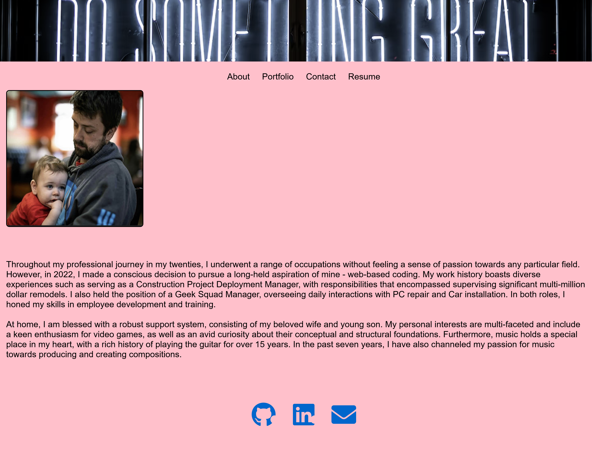

# React-Portfolio
React Portfolio for OSU Bootcamp

## Table of Contents

- [Description](#description)
- [Use](#use)
- [Testing](#testing)
- [Questions](#questions)

## Description
This React Portfolio is to showcase react skills for making a deployed application as well as the work created during my OSU bootcamp. This app uses the following coding items:

1. Node.js
2. Express.js
3. CSS
4. Js
5. HTML
6. React 

## Use

[Deployed App](https://projectmayhem90.github.io/react-portfolio/)

## Testing
None

## Questions
Find me at the following 

Github: [Projectmayhem90](https://github.com/Projectmayhem90)